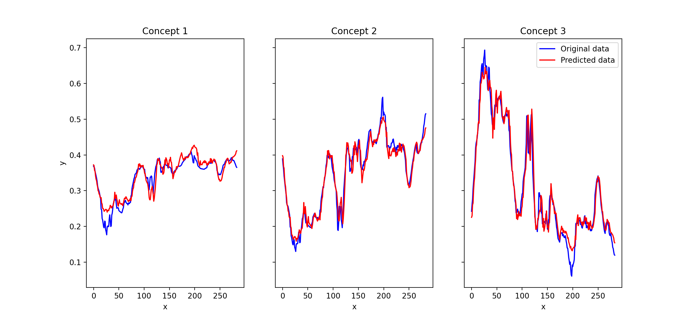

# Cognitive maps in time series prediction

This repository holds Python scripts responsible for training and evaluation of cognitive map–based ML models applied to
the problem of time series prediction.

## Requirements

* python 3.8
* pip

The dependencies can be installed with

```shell
python3 -m pip install --upgrade pip
python3 -m pip install -r requirements.txt
```

## Running

The `train.py` script is responsible for training a model on a set of training data (a folder of CSV files)
and saving it, along with the fuzzy cluster centers trained on this data, to a user-specified directory.

The `evaluate.py` script runs the serialized model on data in the provided CSV file and outputs files with the results,
as well as the inputs transformed into the concept space using centroids extracted from the training data.

Additionally, the `plot.py` script can be used to show a graphic comparison between the original data in concept space
and the predicted values.

To display detailed information about arguments for each script, run

```shell
python3 <script> --help
```

## Examples

1. Train a model on the first category of the "UWave Gesture Library" dataset, setting window width to 30, 
training for 5 epochs, and using 3 concepts. Serialize it to the "model" directory.

```shell
python3 train.py -w 30 -e 5 -c 3 --model-path model\
                 --train-source "./UWaveGestureLibrary/Train/1"\
                 --test-source "./UWaveGestureLibrary/Test/1"
```

&nbsp;&nbsp;&nbsp;&nbsp;&nbsp;&nbsp;&nbsp;&nbsp;Output:
```text
Epoch 1/5
500/500 [==============================] - 7s 13ms/step - loss: 0.0203 - val_loss: 0.0069
Epoch 2/5
500/500 [==============================] - 2s 5ms/step - loss: 0.0055 - val_loss: 0.0034
Epoch 3/5
500/500 [==============================] - 2s 4ms/step - loss: 0.0028 - val_loss: 0.0021
Epoch 4/5
500/500 [==============================] - 3s 5ms/step - loss: 0.0020 - val_loss: 0.0019
Epoch 5/5
500/500 [==============================] - 4s 8ms/step - loss: 0.0017 - val_loss: 0.0016
Done
```

2. Evaluate the model on the `10.csv` file in the 1st category, printing loss function values, 
saving results to `output.csv`, and writing concept-space input data to `output_concept_space.csv`.

```shell
python3 evaluate.py model UWaveGestureLibrary/Test/1/10.csv output.csv
```

&nbsp;&nbsp;&nbsp;&nbsp;&nbsp;&nbsp;&nbsp;&nbsp;Output:

```text
Loading data from 'UWaveGestureLibrary/Test/1/10.csv'
Predicting...

---------------------- Losses ----------------------
Max relative error                          0.865075
Max squared relative error                  0.158491
Mean absolute error                         0.032265
Mean relative error                         0.107688
Mean squared error                          0.001747
Mean squared logarithmic error              0.000983
Mean squared relative error                 0.005692
Symmetric mean absolute error               0.052995
----------------------------------------------------

Saving input data in concept space to 'output_concept_space.csv'
Saving predictions to 'output.csv'
Done
```

3. Show a plot comparing predicted and original data

```shell
python3 plot.py output_concept_space.csv output.csv
```

&nbsp;&nbsp;&nbsp;&nbsp;&nbsp;&nbsp;&nbsp;&nbsp;Output:


